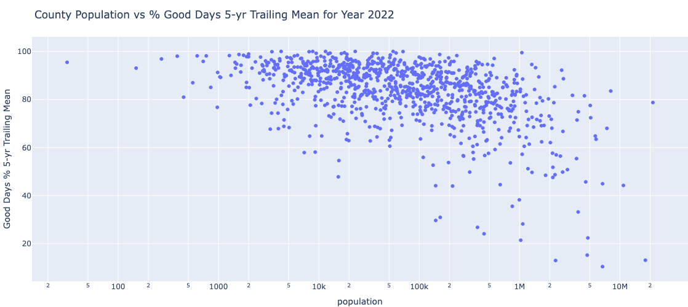
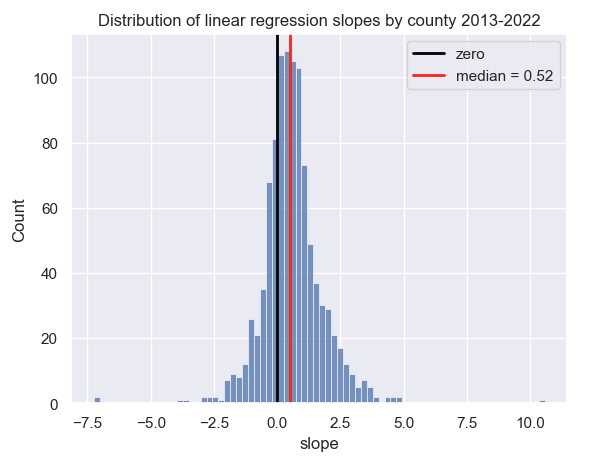
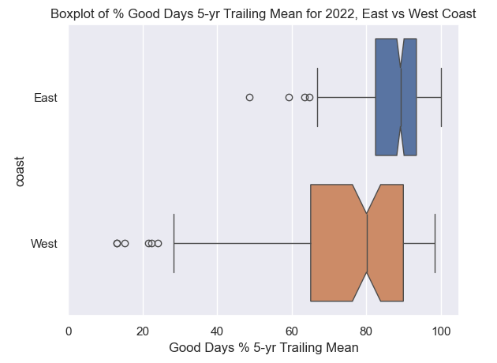

# Exploring US Air Quality
> Maps and descriptive statistics exploring EPA air quality data from 1980-present

## Overview
This project is an educational exercise in data wrangling and exploration, with the goal of better understanding air quality statistics and trends in the United States from 1980 to the present. Annual summary data of county-level air quality index (AQI) values from the EPA are used. Interactive maps (generated using plotly) are often employed to present the data, and a simple linear regression is used to estimate trends.

## Business Understanding
If one were looking to relocate to a different city and wanted to take air quality into consideration, this analysis could prove useful. Or perhaps it could inform policy decisions and direct efforts to a geographic location that would benefit the most.

## Data Understanding
Two data sources are used (and joined together using county FIPS codes):
1. AQI data are from the __[EPA](https://aqs.epa.gov/aqsweb/airdata/download_files.html)__, namely annual summary data by county. The files have the format "annual_aqi_by_county_2023.zip", for example. Counties without monitoring stations are not represented. Data from 1980-present are used.
2. City data which include population are from __[simplemaps.com](https://simplemaps.com/data/us-cities)__.
3. To join the two datasets, state-county FIPS codes are used. Because they are not present in the annual summary files, they are extracted from the __[Site Listings](https://aqs.epa.gov/aqsweb/airdata/aqs_sites.zip)__ file and joined to the AQI data by State + County pairs.

Rather than focus on AQI values, a simpler and more intuitive feature called `Good Days %` is used instead. It is simply the percent of days each year with good air quality as defined as an AQI in the range 0-50. To gain a quick understanding of AQI, see this page at __[airnow.gov](https://www.airnow.gov/aqi/aqi-basics/)__. This variable `Good Days %` was found to roughly follow the empirical rule for a normal distribution.

Data limitations: Not all counties have measurements for every day of the year, and some have very few. Any county with fewer than (an arbitrary) 30 measurements for a given year was excluded to enhance accuracy. This histogram shows the distribution:

## Modeling and Evaluation
(The following is a summary of key points and plots from the full analysis.) 

The general US trend indicates improvement over the years, although there is a notable drop in prevalence of good air quality from about 1998 - 2015. However, the yearly-averaged 90th percentile AQI indicates a more consistant trend of improving air quality.

This is investigated on a more granular basis by averaging across counties per state to get an animated state-level map:

Even more granular is this county-level map. It shows that the Los Angeles and Phoenix areas experienced the fewest days with good air quality in 2022.

A z-score was used to detect outliers that were greater than three standard deviations from the mean. The top two outliers are Los Angeles and Phoenix, each of which experienced only about 40 good air days in 2022, with a median AQI above 70. They each experienced a number of "Unhealthy Days". The following is a map of the outliers in 2022:

The correlation between county population and percent of days with good air is weak at about -38%. An interactive plotly scatter plot is generated: 

A simple linear regression model of the independent variables `Good Days %` and `Years` was created using the last decade of data to determine trends. Because the center of the following distribution is positive, we can conclude that the percent of good days has been improving overall in the last decade.

A county-level map of the regression slopes indicates that the West has experienced a disproportionate amount of declining (red color) air quality over the last decade compared to the rest of the nation.

In fact, a hypothesis test using 2022 data concluded that the average percent of good days is higher on the East Coast than on the West Coast. This boxplot indicates as much; because the notches do not overlap, we can conclude with 95% confidence that the true medians do differ:

A time-series plot of the primary contributor to each day's AQI is shown here for Santa Fe, NM. We see that beginning in 2008, ozone become the primary pollutant, superseding PM2.5:

Time-series plots are also generated to compare multiple cities and visualize trends.

## Conclusion
Air quality has improved overall in the US since 1980, with the East Coast experiencing more days with good air quality on average than the West Coast despite the far larger population in the East. The worst air quality is found in the Los Angeles and Phoenix metropolitan areas.

Ideas for future analysis include: 
- Investigating air quality trends at a state level to see, for example, which states are improving or declining over time with respect to the prevalence of good air days.
- Separating the country by a middle latitude, and checking if there's a statistical difference between North and South.
- Investigating population density and air quality.

The full analysis (Python Jupyter Notebook) can be found [here](https://nbviewer.org/github/jjhigginson/exploring-air-quality/blob/main/Exploring_AQI.ipynb).